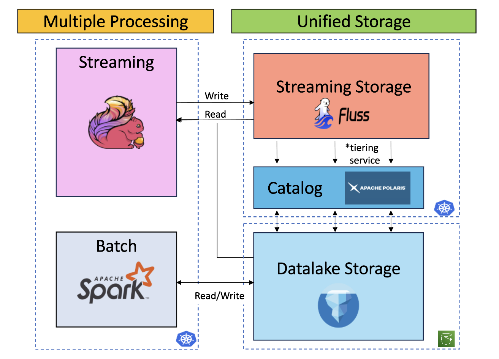

#  Towards a Streaming Lakehouse 🌊

As we delve deeper into a columnar world for data storage and new needs for real time processing emerges through AI, how to maintain a coherent architecture while ensuring governance, performance, operational ease and avoiding cost explosion?

This is what we aim to solve by implementing a **Streaming Lakehouse** : unifying storage with one source of truth between hot streaming data and cold historical one and flexible enough to support business needs requiring daily batch pipeline or sub seconds transformations.

📖 **Full Documentation available at**: [https://markov-ngz.github.io/towards_streaming_lakehouse](https://markov-ngz.github.io/towards_streaming_lakehouse)

 

<figure markdown="span">
  
</figure>

## Motivation

To understand the need for a streaming lakehouse, it is important to recall the current challenges faced when implementing real-time processing for analytics:

- Operational complexity of streaming applications  
- Incompatibility of message queues with analytical workloads  
- Difficulty in assessing the workload and challenges of migrating jobs from batch to streaming  

These points are detailed below:

**Message Queue Challenges**

- Difficulty reading both historical and real-time data together (union reads)  
- No column pruning: full rows must be read, leading to unnecessary network costs  
- Data updates require heavy deduplication processes  

**Assessing Migration from Batch to Streaming**

In practice, how to assess, for a project of this scale, the human workload, business considerations, and potential side effects?

The transition from batch to stream immediately implementation several questions:

- What are the first steps to check technical feasibility?  
- If a schema changes, what protocol should be followed?  
- How can batch jobs be unified with the streaming layer?  
- Should transformations be refactored, and is the current structure capable of supporting this smoothly?  

<u>Not to mention:</u> security, logging, test environments, CI/CD, scaling, load testing, financial budget, disaster recovery, versioning, data quality, and the technical skills required.

Implementing a lightweight version of a streaming lakehouse helps explore multiple areas and identify many issues that need to be addressed early in a project.

**Streaming Application Challenges**

Well known to Flink developers, designing stateful real-time processing applications involves the following challenges:

- Row-based reading instead of columnar (leading to unnecessary network traffic)  
- State size explosion  
- Difficulty debugging state  
- State updates  
- Schema evolution  

How can these issues be solved? Should new features be added to the Flink framework, or should streaming storage systems also evolve to address them?

## What Does Apache Fluss Solve?

Apache Fluss is a core component of a streaming lakehouse. With its tiering service, it enables seamless, periodic transfer of hot data to cold storage. It also introduces columnar streaming using an [Apache Arrow](https://arrow.apache.org/docs/index.html) implementation and shifts from traditional queue/topic-based messaging to [`tablets`](https://fluss.apache.org/docs/table-design/overview/).

This is a key change, as it enables the following:

- Column pruning  
- Data updates using KV tablets (avoiding heavy deduplication) with multiple [merge engines](https://fluss.apache.org/docs/table-design/merge-engines/)  

Additionally, Flink integration with Fluss (which stands for *Flink Unified Streaming Storage*) improves:

- State reduction (e.g., delta joins) by moving processing from the application layer to streaming storage (resulting in faster checkpoints, quicker recovery, and lower memory usage)  
- Easier debugging by querying Fluss tables directly (less opaque)  
- Unified reads of historical and streaming data, handled seamlessly by Flink with Fluss

## Implementation

This project is divided into three parts:

- <u>Deployment on Kubernetes with S3 as remote storage:</u> Fluss cluster, Polaris API, Spark, and Flink operators and deployments  
- <u>Application-specific features with Flink and Fluss:</u> delta joins, lookups, and materialized tables  
- <u>Business use case:</u> customer order first-touch attribution (i.e., how a customer enters the sales funnel)  

## Challenges and Next Steps

From here, several technical aspects could be explored in more detail:

- Security implementation: at the Kubernetes cluster level or within Fluss applications  
- Operational scenarios: step-by-step protocols for performing changes  
- Cost and performance analysis  
- A clear comparison between Kafka and Fluss  
- Choosing between Paimon and Iceberg  

For more example use cases, I highly recommend the following articles:

- [Real-Time Multi-Dimensional Unique Visitor Deduplication in Practice](https://fluss.apache.org/blog/taobao-practice) by Yang Wang  
- [How Taobao uses Apache Fluss (Incubating) for Real-Time Processing in Search and RecSys](https://fluss.apache.org/blog/roaringbitmap-uv-deduplication/) by Xinyu Zhang and Lilei Wang  

## Cite and Share

Please consider adding a star ✨ to the repository if you found this work and documentation useful.

## Notes

The title is a reference to the article [`Towards A Unified Streaming & Lakehouse Architecture`](https://fluss.apache.org/blog/unified-streaming-lakehouse/) by Luo Yuxia (Alibaba Cloud).