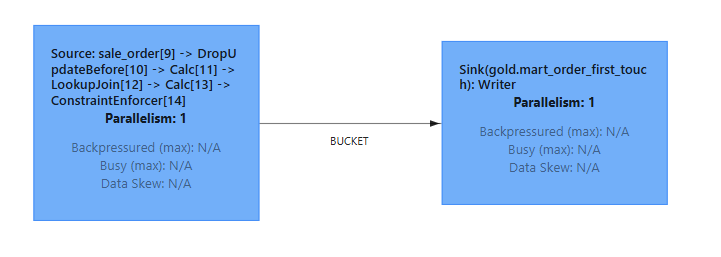
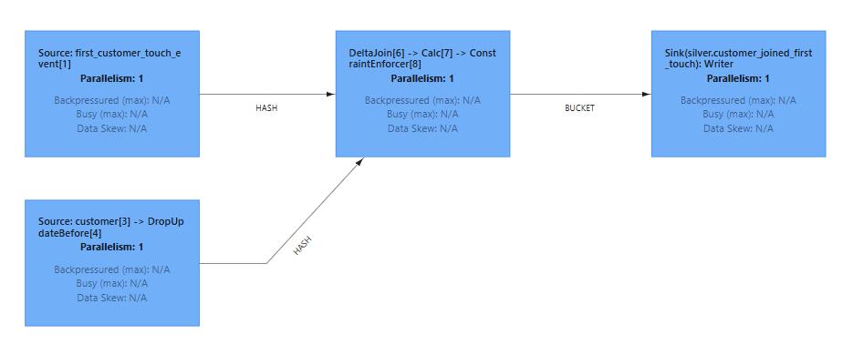

# Flink Applicative overview 

This document outlines how Fluss, integrates with Flink to optimize performance and data handling. Key benefits include:

- Reduced state size for faster backups and checkpoints
- Lower memory usage
- Seamless integration with historical data

The following Flink features and patterns were implemented for smooth Fluss integration:

- first_row merge type
- Delta join
- Lookup join
- Materialized table
- Union read

>Note: The Spark component is omitted, as it only involves a basic batch job and was not the main focus of this project.

## 1.  Merge Type : `first_row`

The `first_row` merge type is used to retrieve the first event for a customer. This approach retains the initial insert for a given primary key. Given that the bucket retention time is set to 7 days, only data within this window is accessible.

**Note:** Tightly coupling technical retention time to a domain rule is clearly not a good practice and should be changed.

## 2. Lookup Join

A [lookup join](https://nightlies.apache.org/flink/flink-docs-master/docs/sql/reference/queries/joins/#lookup-join) is performed when a table is joined with another table queried from an external system.

In this implementation, the lookup join enriches order data with corresponding customer information.

<figure markdown="span">
  
  <figcaption> Lookup join view</figcaption>
</figure>

---

## 3. Delta Join

In brief, a [delta join](https://cwiki.apache.org/confluence/display/FLINK/FLIP-486:+Introduce+A+New+DeltaJoin) enables joining with a "remote" state using a key lookup mechanism, which avoids data duplication between the streaming layer and Flink worker state.

Here, the `first_customer_touch_event` stream is joined with customer data stored in Fluss.

<figure markdown="span">
  
  <figcaption> Delta join view</figcaption>
</figure>

For further technical details, refer to [Fluss Delta Joins Documentation](https://fluss.apache.org/docs/engine-flink/delta-joins/), it is really well explained.

---

## 4. Materialized Table

Materialized tables address the challenge of unifying batch and streaming data. To make a table usable by a streaming layer, a scheduled or streaming job fetches data from the "cold" layer to the "hot" layer.

Here the data ingested by the spark job to the `existing_namespace.campaign` table should be periodically extracted and synced to the streaming storage.

> **Note:** A configuration issue was encountered, as the job executed only once and did not continue as scheduled. I did not throughly investigated whether it was an issue coming from Fluss or Flink

---

## 5. Union Read

**Disclaimer:** This feature was not thoroughly verified in this project, but it is highly relevant. Union read allows querying both the stream (with the freshest data) and historical data. While performance should be monitored, the potential of this tool is significant and worth highlighting.