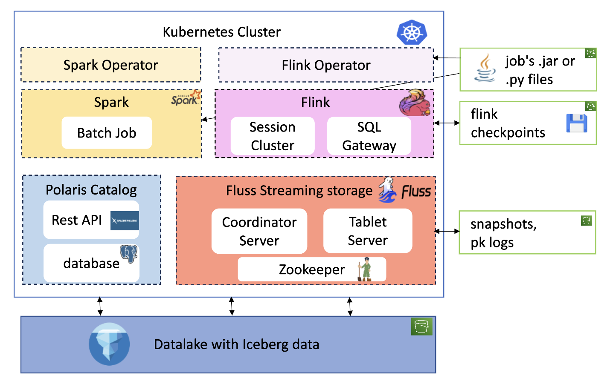
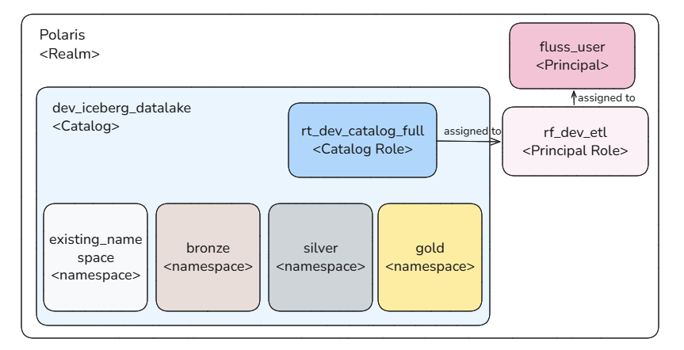
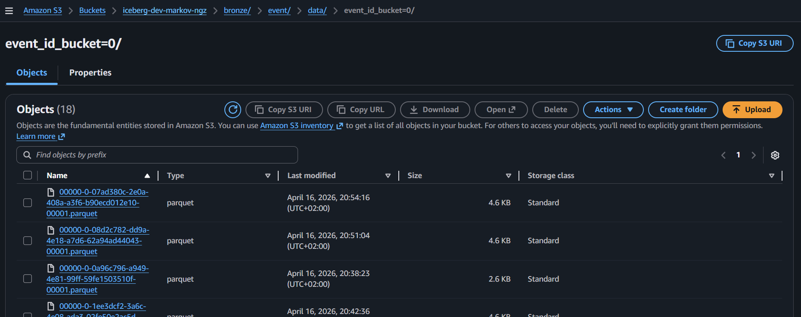

# Kubernetes Deployment

Two deployment methods are available:

- **Kubernetes** (production)
- **Docker** (for local testing and configuration validation)

This guide focuses on Kubernetes deployment, as it best illustrates key challenges:

- Continuous deployment
- Logs & persistence
- Security & role management
- Monitoring and performance

Even if those are aspects are not adressed in this project, the context of kubernetes already expose those issues and which are necessary to go past a poc to production.


---

## Resource Overview

The deployment includes the following resources and integrates with remote storage (S3):

<figure markdown="span">
  
</figure>


---

## Namespaces

Resources are organized into the following namespaces:

- Applicative namespaces: polaris , fluss , flink ,spark 
- Technical namespaces : technical-spark-operator , technical-flink-operator 

---

## Operators


### Flink

The [flink-kubernetes-operator](https://nightlies.apache.org/flink/flink-kubernetes-operator) is used for Flink deployments. The Helm chart is customized to pull `.jar` files from an S3 bucket, featuring:

- A custom operator pod image with the S3 filesystem Hadoop plugin
- AWS environment variables for S3 authentication

This allows loading JARs for `FlinkDeployment` or `FlinkSessionJob` using the URI:
```yaml
job:
  jarURI: s3://<bucket>/<job_path>.jar
```
Which can be useful depending the CI used for a project.

### Spark

Spark is deployed using a custom Helm chart based on the [spark-on-k8s-operator](https://github.com/GoogleCloudPlatform/spark-on-k8s-operator).

<u>No custom configurations were made at the helm chart level :</u> different from flink's operator , to be able to download the `.py` or `.jar` job file from a s3 bucket, it is not the operator's controller or webhook image which is modified but the deployment's. 

Hence the base spark image used has aws sdk baked into it and authentication is made with classic secrets as secrets.


---

## Polaris

The Polaris Helm chart is customized with:

- AWS secrets for S3 access
- JDBC persistence for PostgreSQL integration

A PostgreSQL database is instantiated with default credentials.

OAuth2 is used for authentication, with the following resources created:

- Catalog
- Namespace
- Catalog role
- Principal role
- Principal

<figure markdown="span">
  <figcaption>Polaris resources created</figcaption>
  
</figure>


Client applications use principal credentials to obtain a token for catalog interaction.

---

## Fluss

The Fluss Helm chart is customized with:

- A custom image including S3 dependencies
- AWS secrets for KV data persistence (independent of Iceberg)
- REST Iceberg configuration with principal credentials

Since [Raft](https://raft.github.io/) is not available, [ZooKeeper](https://zookeeper.apache.org/) is deployed as the cluster manager, with a PVC for state persistence.

---

## Flink deployment

Flink is deployed in **session mode** to reduce workload on the local cluster.

Session jobs are submitted via:

- Kubernetes CRDs: `FlinkSessionJob` and `FlinkDeployment`
- SQL Gateway REST API: using a tool to execute SQL scripts

SQL catalogs are mounted to the `flink-main-container` via a ConfigMap and configured as a [file catalog store](https://nightlies.apache.org/flink/flink-docs-stable/docs/dev/table/catalogs/#filecatalogstore).

The SQL Gateway is deployed separately and submits requests to the main cluster.

For further reading, see this [article ](https://medium.com/@katyagorshkova/hands-on-with-flink-part-3-sql-instead-of-java-0a5d698e39be)


## Spark deployment


## AWS Infrastructure: Storage Requirements

This project requires **S3 remote storage** for the following components:

- Iceberg table data
- Flink checkpoints
- Flink JAR files
- Fluss PK table snapshots and tiered log segments

The infrastructure is provisioned using [Terraform](https://developer.hashicorp.com/terraform).

<figure markdown="span">
  
  <figcaption>Screenshot of Iceberg's parquet files </figcaption>
</figure>