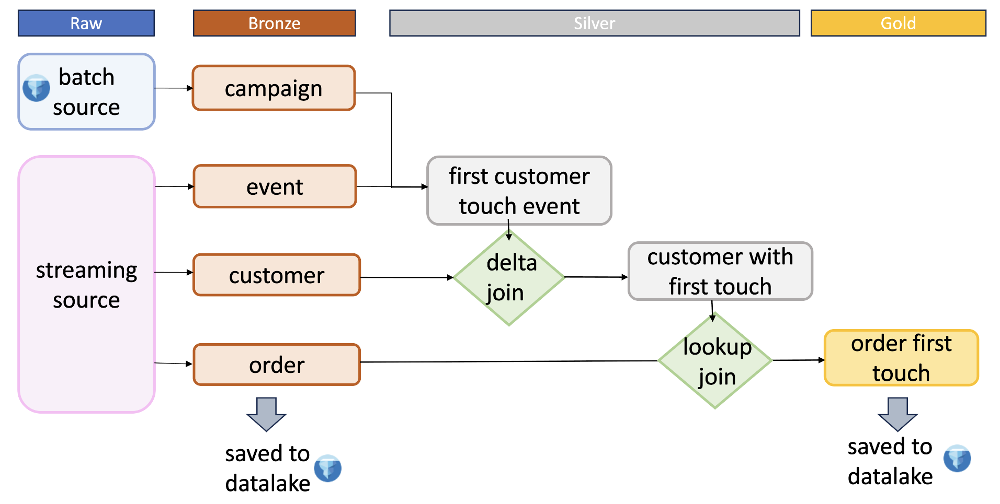
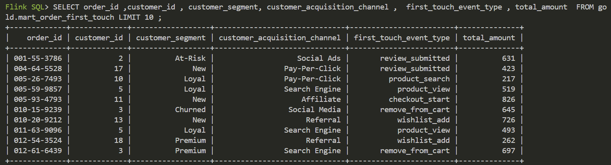

# Use case : First-touch attribution

While the primary motivation of this project is technical—exploring Flink processing with Fluss—the chosen use case is designed to naturally exercise the key features under evaluation.

In particular, this use case allows us to leverage:

- a lookup join  
- a delta join  
- a materialized table  
- the `first_row` merge type  

These requirements are not introduced arbitrarily; they emerge from a common marketing analytics problem: attribution.

The goal of this data transformation is to answer the following business question:

**What brought the user into the funnel?**

To answer this, we identify the first interaction (event) a customer had within the 7 days leading up to a purchase. This “first touch” event is then associated with the corresponding order, enabling attribution of the conversion origin.

The resulting data mart, `mart_order_first_touch`, consolidates this information from the following source tables:

- `sale_order`: contains order-level information  
- `customer`: provides customer details  
- `event`: stores user interactions (e.g., website visits, clicks, etc.)  
- `campaign`: describes marketing campaigns linked to events  

<figure markdown="span">
  <figcaption> Medallion model </figcaption>
  
</figure>

## Structure

The transformations follows the medallion model with the 3 layers ( bronze, silver , gold).

This is very simple as a first brick is made from customer and event data which is then joined with the order data.

## Mart 

| Column Name                  | Data Type | Description                                                          |
| ---------------------------- | --------- | -------------------------------------------------------------------- |
| order_id                     | STRING    | Unique identifier for each order (primary key, not enforced)         |
| customer_id                  | STRING    | Identifier of the customer who placed the order                      |
| order_timestamp              | TIMESTAMP | Timestamp when the order was placed                                  |
| total_amount                 | DECIMAL   | Total monetary amount of the order                                   |
| customer_segment             | STRING    | Segment category assigned to the customer                            |
| customer_acquisition_channel | STRING    | Channel through which the customer was acquired                      |
| first_touch_event_id         | STRING    | Identifier of the first marketing/event interaction for the customer |
| first_touch_timestamp        | TIMESTAMP | Timestamp of the first customer interaction                          |
| first_touch_event_type       | STRING    | Type of the first interaction event (e.g., click, view)              |
| first_touch_campaign_name    | STRING    | Name of the campaign associated with the first interaction           |
| delta_first_touch_to_order   | TIMESTAMP | Time difference between first touch and order                        |
| _tech_write_ts               | TIMESTAMP | Technical timestamp indicating when the record was written           |

Here is what data would look like : 

<figure markdown="span">
  
</figure>

## Data Used 

**Event**

| Column Name | Data Type | Description                                                  |
| ----------- | --------- | ------------------------------------------------------------ |
| event_id    | STRING    | Unique identifier for each event (primary key, not enforced) |
| customer_id | STRING    | Identifier of the customer associated with the event         |
| event_type  | STRING    | Type of event (e.g., click, view, purchase)                  |
| campaign_id | STRING    | Identifier of the marketing campaign linked to the event     |
| event_ts    | BIGINT    | Event timestamp (typically in epoch format)                  |

**Sale Order**

| Column Name  | Data Type      | Description                                                  |
| ------------ | -------------- | ------------------------------------------------------------ |
| order_id     | STRING         | Unique identifier for each order (primary key, not enforced) |
| customer_id  | STRING         | Identifier of the customer who placed the order              |
| total_amount | DECIMAL(10, 2) | Total monetary amount of the order                           |
| order_ts     | BIGINT         | Order timestamp (typically in epoch format)                  |

**Customer**

| Column Name         | Data Type | Description                                                     |
| ------------------- | --------- | --------------------------------------------------------------- |
| customer_id         | STRING    | Unique identifier for each customer (primary key, not enforced) |
| email               | STRING    | Customer email address                                          |
| phone               | STRING    | Customer phone number                                           |
| segment             | STRING    | Customer segmentation category                                  |
| acquisition_channel | STRING    | Channel through which the customer was acquired                 |
| country             | STRING    | Country of the customer                                         |
| opt_in              | BOOLEAN   | Indicates whether the customer opted in for communications      |
| last_purchase_ts    | BIGINT    | Timestamp of the customer’s last purchase (epoch format)        |

**Campaign**

| Column Name         | Data Type | Description                                                     |
| ------------------- | --------- | --------------------------------------------------------------- |
| id         | INT    | Unique identifier for a campaign |
| name               | STRING    | Name describing the campaign                                      |